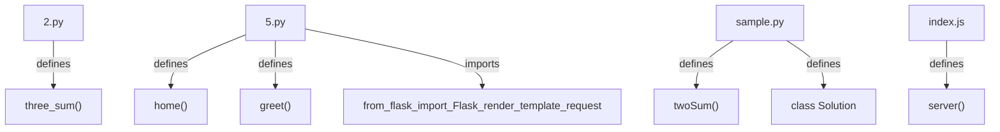
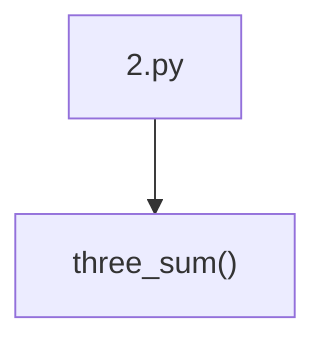
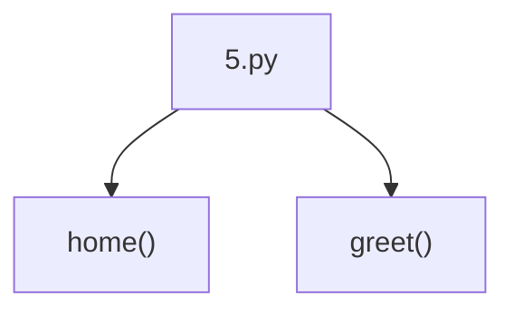
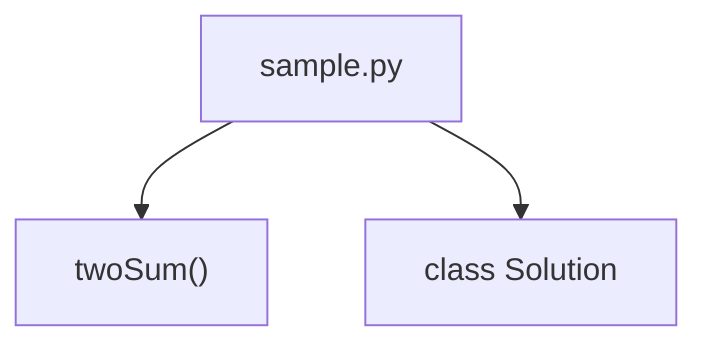
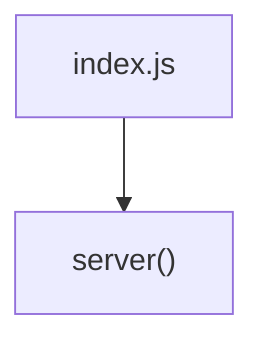
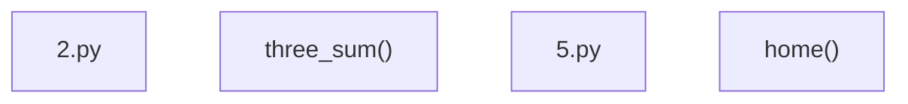

# Project Documentation

## Project Overview
Files: 4
Functions: 5
Classes: 1
Imports: 1

## Architecture Overview


## Stats
- Files: 4
- Functions: 5
- Classes: 1
- Imports: 1

## Folder Structure
```
./
    2.py
    5.py
    index.js
    sample.py
```

## Per-File Workflows
### 2.py


### 5.py


### sample.py


### index.js


## Modules
### 2.py
Language: python

#### What This File Does
This file contains utility functions: def three_sum(nums):. It provides helper methods for the application.

#### Line-by-Line Explanation
- Line 2: Define function three_sum
- Line 4: Variable assignment - result = []
- Line 5: Loop iteration - for i in range(len(nums) - 2):
- Line 6: Conditional check - if i > 0 and nums[i] == nums[i - 1]:
- Line 8: Variable assignment - left, right = i + 1, len(nums) - 1
- Line 10: Variable assignment - total = nums[i] + nums[left] + nums[right]
- Line 11: Conditional check - if total < 0:
- Line 12: Variable assignment - left += 1
- Line 13: Conditional check - elif total > 0:
- Line 14: Variable assignment - right -= 1

#### Dry Run / Execution Trace
```
Dry run execution trace would depend on specific inputs and application state.
```

#### Imports
- None

#### Functions
- three_sum(nums) — (no docstring)

#### Classes
- None

### 5.py
Language: python

#### What This File Does
This file contains utility functions: def home():, def greet():. It provides helper methods for the application.

#### Line-by-Line Explanation
- Line 3: Variable assignment - app = Flask(__name__)
- Line 5: Define function home
- Line 6: Return statement - return render_template('index.html')
- Line 7: Variable assignment - @app.route('/greet',methods=['POST'])
- Line 8: Define function greet
- Line 9: Variable assignment - name = request.form.get('name')
- Line 10: Variable assignment - return render_template('greet.html',name=name)
- Line 11: Conditional check - if __name__ == '__main__':
- Line 12: Variable assignment - app.run(debug=True)

#### Dry Run / Execution Trace
```
Dry run execution trace would depend on specific inputs and application state.
```

#### Imports
- from flask import Flask,render_template,request

#### Functions
- home() — (no docstring)
- greet() — (no docstring)

#### Classes
- None

### sample.py
Language: python

#### What This File Does
This file implements a LeetCode-style solution for the two-sum problem. It contains a Solution class with a method that finds two numbers in a list that add up to a target value using a hash map for O(n) time complexity.

#### Line-by-Line Explanation
- Line 1: Define class Solution
- Line 2: Define function twoSum
- Line 8: Variable assignment - d={}
- Line 9: Loop iteration - for i,j in enumerate(nums):
- Line 10: Variable assignment - k=target-j
- Line 11: Conditional check - if k in d:
- Line 12: Return statement - return [d[k],i]
- Line 14: Variable assignment - d[j]=i

#### Dry Run / Execution Trace
```
Example Execution (Two-Sum Problem):
Input: nums = [2, 7, 11, 15], target = 9
1. Initialize empty dict: d = {}
2. Iterate through nums:
   - i=0, j=2: k = 9-2 = 7, 7 not in d, d[2] = 0
   - i=1, j=7: k = 9-7 = 2, 2 IS in d, return [d[2], 1] = [0, 1]
Output: [0, 1] (indices of 2 and 7 that sum to 9)
```

#### Imports
- None

#### Functions
- twoSum(self, nums, target) — :type nums: List[int]
:type target: int
:rtype: List[int]

#### Classes
- Solution

### index.js
Language: javascript

#### What This File Does
This file sets up a web server. It creates an HTTP server that listens on a specified port and handles incoming requests, returning responses to clients.

#### Line-by-Line Explanation
- Line 1: Import module - const http = require('node:http'); // Import the b
- Line 2: Declare variable hostname
- Line 3: Declare variable port
- Line 6: Declare variable server
- Line 11: Send response to client
- Line 15: Start server listening

#### Dry Run / Execution Trace
```
Example Execution (HTTP Server):
1. Load http module
2. Define hostname = '127.0.0.1', port = 3000
3. Create server: listen for requests on 127.0.0.1:3000
4. Client sends GET request to http://127.0.0.1:3000/
5. Server receives request, sets status 200 (OK)
6. Server returns response: "Hello, World!"
7. Client receives response and displays message
Output: Browser shows "Hello, World!" at http://127.0.0.1:3000/
```

#### Imports
- None

#### Functions
- server() — (no docstring)

#### Classes
- None

## Summaries
### Architecture


### Files
- 2.py (imports: 0, funcs: 1, classes: 0)
- 5.py (imports: 1, funcs: 2, classes: 0)
- sample.py (imports: 0, funcs: 1, classes: 1)
- index.js (imports: 0, funcs: 1, classes: 0)

### Functions
- three_sum in 2.py: args=['nums'] doc=None
- home in 5.py: args=[] doc=None
- greet in 5.py: args=[] doc=None
- twoSum in sample.py: args=['self', 'nums', 'target'] doc=:type nums: List[int]
- :type target: int

### Changes
- Unable to generate summary (no content).

### Gitignore
No .gitignore present.

## Git Insights
- Not a git repository (no commit history available)

## How to Run
### 2.py
**Command:** `python 2.py`

**Dependencies:**
- (no external dependencies)

### 5.py
**Command:** `python 5.py`

**Dependencies:**
- from flask import Flask,render_template,request

### sample.py
**Command:** `python sample.py`

**Dependencies:**
- (no external dependencies)

### index.js
**Command:** `node index.js`

**Dependencies:**
- (no external dependencies)
